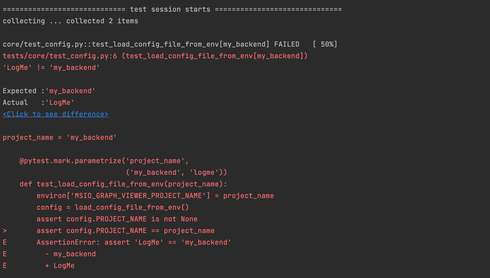
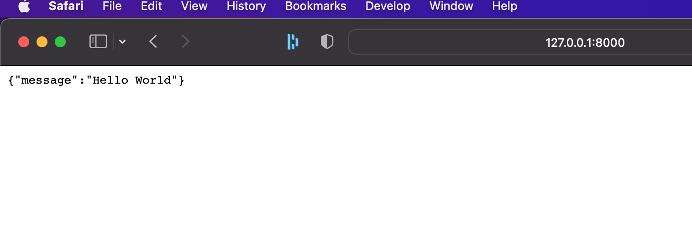
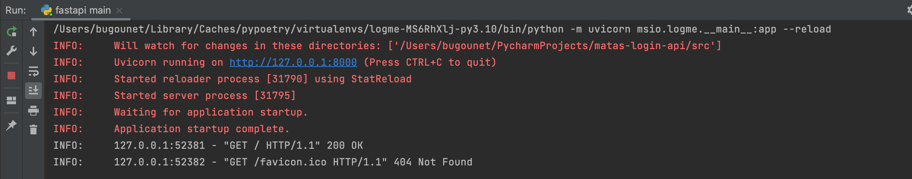
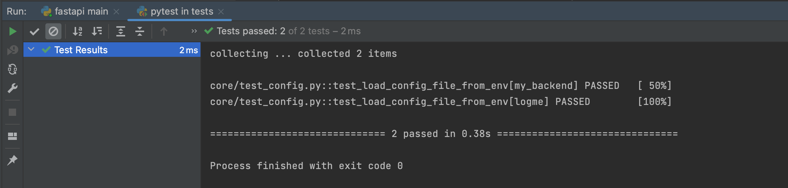

# Setup de l'env et premiers fixs

Merci pour le fichier toml, ça aide. J'installe
tout, je configure mon EDI. Premiere 
surprise : les tests fournis ne tournent pas.



Il s'agissait d'une coquille dans le test. (un 
copié-collé ?)

Quelques petites autres surprises comme la casse
de PROJECT_NAME qui n'était pas bonne entre 
la config et le `main`. Après ces petits fixs 
j'arrive à mes fins :
Le `hello world` est opérationnel et tous 
les tests passent.







Il me manque un dernier truc dans mon setup:
une base de données.  Je vais le
mettre dans un conteneur docker. J'en profite
pour te remettre le `docker-compose.yml`. 

Je fige une version de poetry
dans les build-args pour éviter les 
évolutions cassantes, et par principe de précaution.
J'exploite les variables d'env prévues dans le
fichier `config.py`.

Si tu veux jouer avec, voici les commandes pour
build l'image manuellement, run un conteneur
ou lancer tout le docker-compose:

```shell
docker build --build-arg POETRY_VERSION=1.1.14 -f ./docker/Dockerfile -t api .
docker run -p 8000:8000 --env-file ./docker/.env api
docker compose -f docker/docker-compose.yml up --build
```

Pour former la DB j'ai vu ton fichier SQL. Je préfère utiliser
a Alembic car il me permettra de faire des migrations de schéma,
sur le long terme. Il n'est pas dans le `pyproject.toml` donc
je l'ajoute.

J'ajoute alembic, et psycopg2-binary pour
pouvoir run mes migrations.

[--> créer le premier utilisateur](03-creer-first-user.md)
