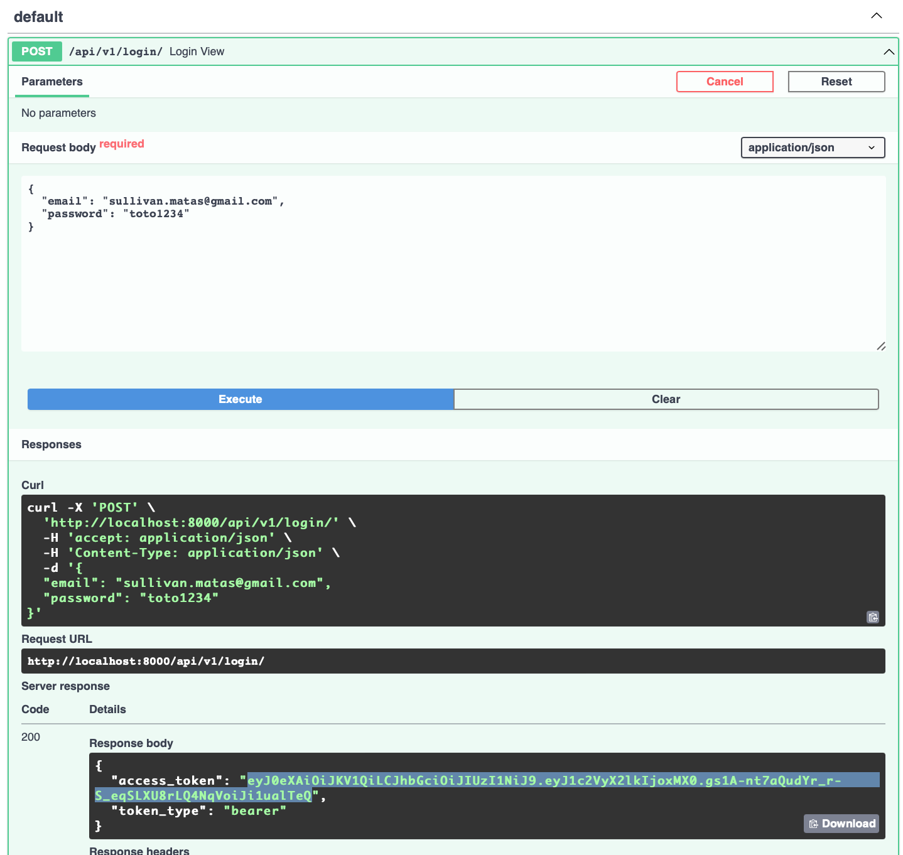
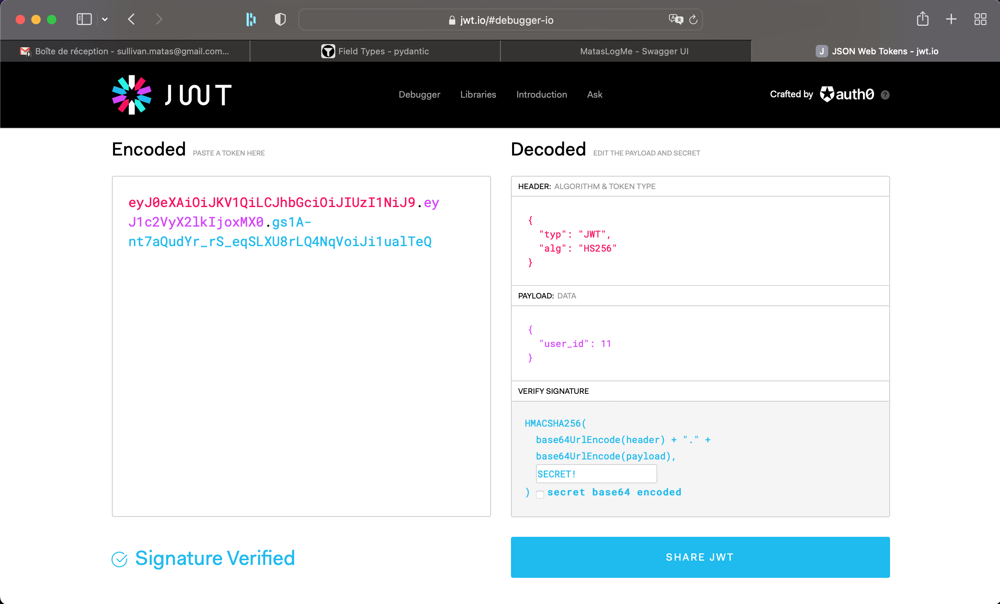

# Recréer les endpoints que tu as supprimé

A force de toucher aux sources, je me suis rendu
compte que certes les endpoints login et logout
sont manquants, mais tous les endpoints
du CRUD le sont aussi. Ce n'est pas grave, je vais
m'en occuper.

Pour implémenter ce CRUD, je choisis de partir
sur une implémentation en clean architecture.
Cette architecture va me permettre de décorréler
le domaine (actions qu'on va pouvoir faire
sur les utilisateurs) de leur implémentation
concrète.

Je crée donc une interface UserRepository qui
me permet d'inverser la dépendance entre mon
domaine et la base de données. 
Faire ce travail permet de commencer à réléchir
aux actions que je vais faire sur ma base
de données. J'y vois pour le moment 6 actions:
- trouver un utilisateur à partir de ses credentials
- trouver un utilisateur à partir de son email
- trouver un utilisateur à partir de son ID
- lister tous les utilisateurs (pas de filtre)
- créer un nouvel utilisateur
- supprimer un utilisateur

La logique métier va se trouver dans les use-cases
ainsi que dans les entités. Exemple : le calcul
du hash des mots de passe des utilisateurs
va être rangée dans l'entité utilisateur
tandis que la génération d'un access token
à partir de l'utilisateur sera plutôt côté 
use-case.

Premier résultat : j'ai ma fonction de login sans
faire beaucoup d'efforts sur sa documentation
dans swagger...

Je procède ainsi jusqu'à avoir les endpoints
- login
- logout
- les 4 routes de CRUD sur l'utilisateur

